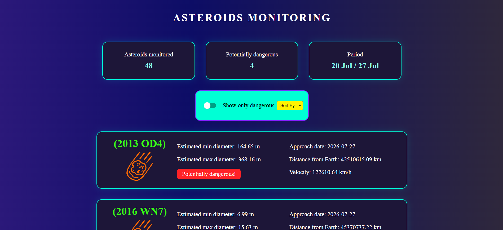

# ☄️ Asteroids Monitoring

A full-stack web application built with **Next.js** and **FastAPI** that monitors near-Earth asteroids using NASA's NeoWs API.

## Live Demo

https://asteroids-monitoring-phi.vercel.app/

Backend API: https://asteroids-monitoring-production.up.railway.app

## Features

* Monitor asteroids approaching Earth over the next 7 days
* Display detailed information for each asteroid
* Filter potentially hazardous asteroids
* Sort asteroids by:

  * Distance
  * Velocity
  * Diameter
* Responsive user interface
* Error handling for API requests

## Tech Stack

### Frontend

* Next.js
* React
* CSS

### Backend

* FastAPI
* Python
* HTTPX

### External API

* NASA NeoWs API

## Screenshots



## Installation

### Clone the repository

```bash
git clone https://github.com/gilbert-gr/asteroids-monitoring.git
```

## Environment Variables

Create a `.env` file inside the `backend` folder:

```env
NASA_API_KEY=your_api_key
```

### Backend

```bash
cd backend
python -m venv .venv
pip install -r requirements.txt
uvicorn app.main:app --reload
```

### Frontend

```bash
cd frontend
npm install
npm run dev
```

## Author

**Gilbert Grange**
